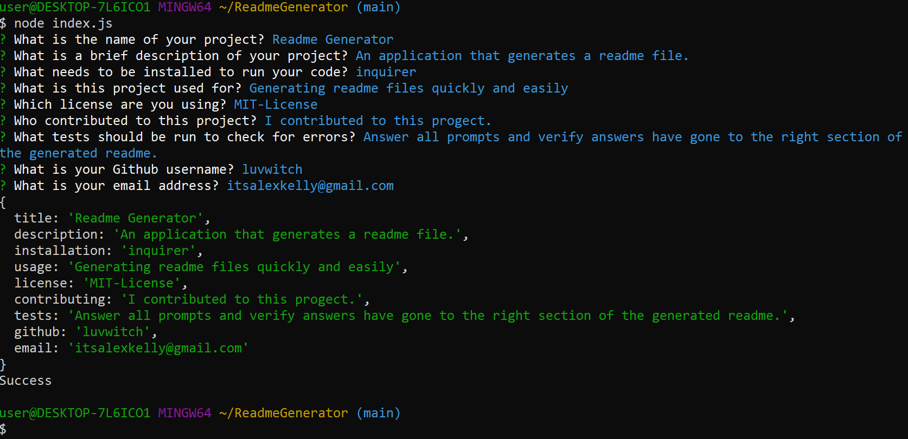

# Professional README Generator

## Description

An easy to use console based application that assists in writing and creating a professional README.md file.

## User Story

AS A developer <br>
I WANT a README generator<br>
SO THAT I can quickly create a professional README for a new project.


## Table of Contents
* [Usage](#usage)
* [Demo](#demo)
* [Contact](#contact)

## Usage

The application will be invoked by using the following command:

```bash
node index.js
```
Once invoked, the console runs through a series of questions and uses the answers given to generate a professional looking README.md file using an empty template. The responses are console logged and the new filled-in README.md file is created with that information.


## Demo



Video of project in use:

https://drive.google.com/file/d/19WHzHYCT5NA3b4bi34lnuC_JBRb7xqYE/view

[](https://drive.google.com/file/d/19WHzHYCT5NA3b4bi34lnuC_JBRb7xqYE/view)


## Contact

Any further questions? Please send me an email at:

itsalexkelly@gmail.com

To view my other projects feel free to view my Github profile at:

github.com/luvwitch
